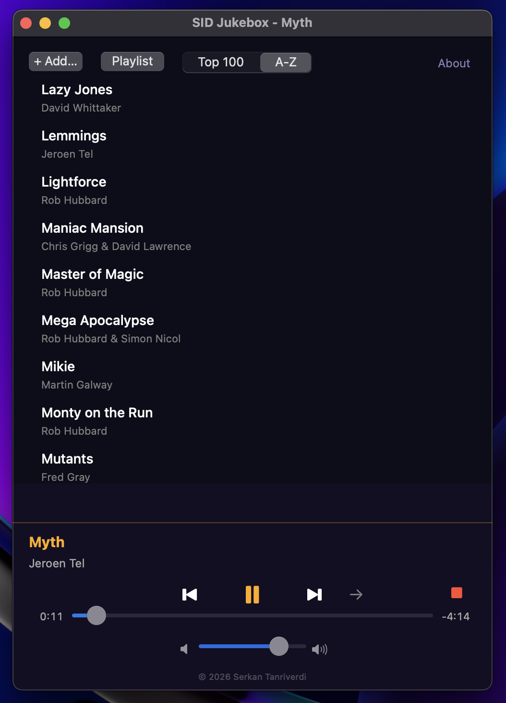

# SID Jukebox v1.0

A native macOS player for Commodore 64 SID music. Emulates the MOS 6581/8580 SID chip using the cSID engine by Hermit.



[Download v1.0](https://github.com/serkantanriverdi/sidJukeBox/releases/download/v1.0/SIDJukebox_v1.0.dmg) — Signed & notarized

## Build

```bash
./build.sh
```

Requires Xcode Command Line Tools. Produces a universal binary (arm64 + x86_64) .app bundle and a .dmg.

## Features

- 100 tracks ranked by community consensus (HVSC, Lemon64)
- Real track durations from HVSC Songlengths database
- Shuffle, sequential and repeat playback modes
- Custom playlists — create, save and manage (persisted across sessions)
- Volume control
- Menu bar (tray) support — minimize to tray, control playback from menu bar, keeps playing in background
- Sort by ranking or alphabetically
- Right-click context menu to add/remove tracks from playlists
- About panel with retro C64 styling
- Keyboard shortcuts: Cmd+P (play/pause), Cmd+N (next), Cmd+B (previous), Shift+Cmd+S (stop)
- Signed and notarized by VIV TEKNOLOJI LIMITED SIRKETI

## Files

- `main.m` — entire application (Objective-C, Cocoa)
- `sid_engine.c` / `sid_engine.h` — cSID emulator by Hermit
- `build.sh` — build script (universal binary + DMG)
- `AppIcon.icns` — application icon
- `sids/` — 100 SID files (PSID format)

## Composers

Rob Hubbard, Martin Galway, Ben Daglish, Jeroen Tel, Tim Follin, Chris Huelsbeck, Matt Gray, David Whittaker, Reyn Ouwehand, Fred Gray, Mark Cooksey and others.

## Requirements

- macOS 10.13+
- No external dependencies

## Author

Serkan Tanriverdi — www.serkantanriverdi.com

Copyright 2026 Serkan Tanriverdi
